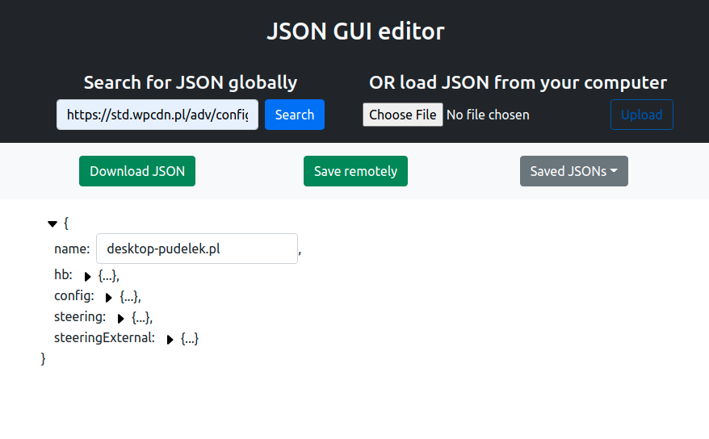
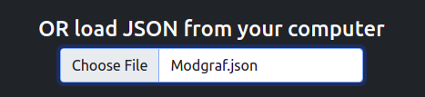
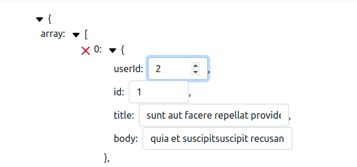
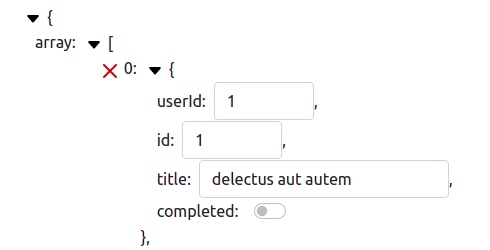
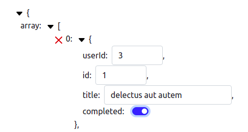
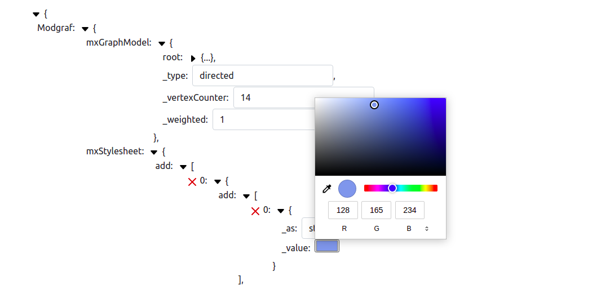
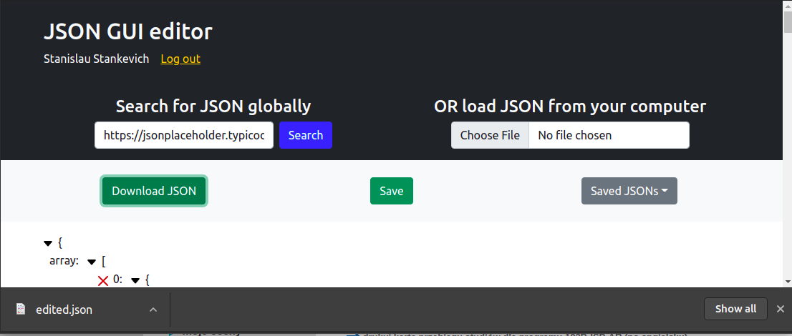
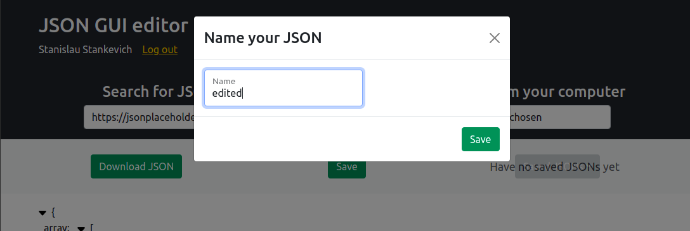
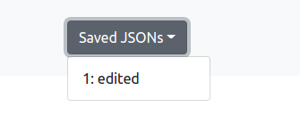
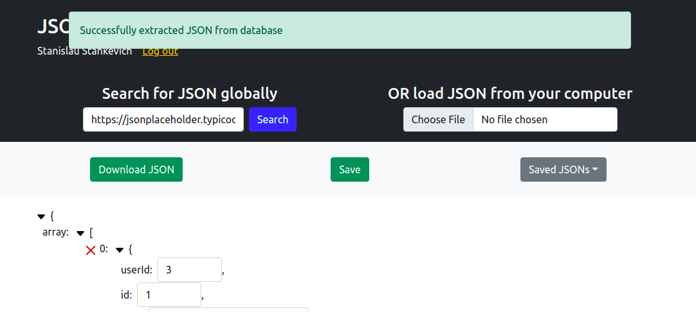

### JSON editor

Served in Heroku: [https://json-editor-1.herokuapp.com/](https://json-editor-1.herokuapp.com/)

### Set up

To install client dependencies first of all clone the root directory

`git clone https://github.com/nkvch/JSON-editor1`

Then in the root directory run to install React-app dependencies

`npm run client-install`

To run the app run

`npm run dev`

### Editing JSON

App allows to fetch JSON object from url like on the screenshot above and also to upload a JSON from local machine:

Uploaded or fetched JSON is interpreted as JS-object and can be edited (changing object's values and reducing arrays is possible, creating new values or new JSON from scratch as well as changing JSON keys will be possible in upcoming version).

String values are interpreted as `type="text"` input fields, number values - as `type="number"` input fields:

Booleans are interpreted as switches:

So that they could be easily changed:

Values like `#123456` are interpreted as color-pickers:

Edited JSON can be easily downloaded locally:

### Features for logged in users

Soon as user has created an account and logged in (all passwords are got `bcrypt`ed when creating an account) saving to and extracting JSONs from remote database (mongo Atlas) becomes available.

After clicking the Save button user is asked to give a name for JSON:

Saved JSONs are available from dropdown:

After extracting JSON user can edit it, download it and update it's version in database by clicking Save one more time.

### Technology stack

App is build on MERN stack using Redux for state managment, Bootstrap and some custom Scss for styling. 

Client is a React application build on Hooks, server is NodeJS Express app, MongoDB Atlas is used as remote data storage to save JSONs.

App state is preserved in Redux. Using `redux-persist` storage to store JWT token (1 day token) allows to still be logged in after refreshing and not loosing actual processed JSON. 
 
